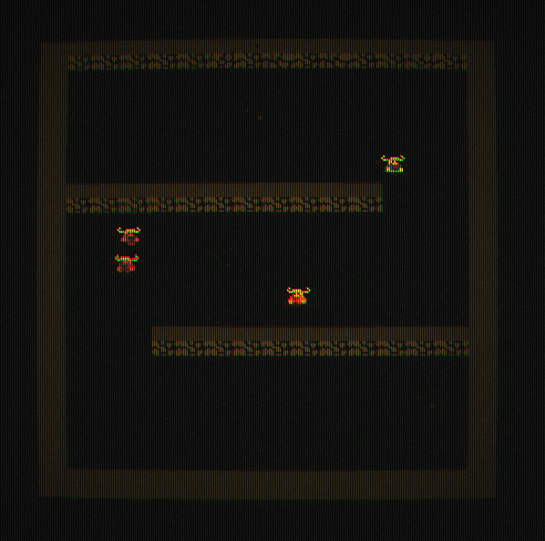

# 
Game demo slice

Hello!

Thank you for taking the time to check out this repo. It's a smaller vertical slice of a game I'm working on in my free time, based on a prototype from 2021 (Go + Lua).

## Disclaimer

There's some ~800 lines of code here, primarily for demonstrative purposes. I've deliberately not included any resources as I'm planning
to release this game at some point; hence they're private.

The full codebase is closer to 3k lines, as I'm only a few weeks into the development, where development means "when everyone else is asleep" (I'm on parental leave).

## Explanation

Thanks to the architecture (ECS via [hecs](https://github.com/Ralith/hecs)), the code does not (currently) rely on any smart pointers (eg. Rc, RefCell etc). Instead, all scopes are such that **&mut** works fine despite having cross cutting concerns across several systems.

No vectorization or parallelism; I'm currently able to render 60FPS with 40k units moving around on the screen on a ~6 year old Intel i5. There are a few uses of async, but that has more to do with the APIs that I am consuming rather than any specific usecase.

With the exception of functional style iterators and pattern matching, the code is quite procedural.

## Omitted features

- More states (crate::entities::State)
- OpenGL rendering (setup, GLSL shaders etc)
- Actual assets

## Areas of interest

`main.rs` is pretty straightforward. Navigate to whichever module seems interesting.

## Closing notes

I hope you find this interesting. I'm happy to answer any questions, and am looking forward to hearing from you in the future!

All the best,
 
~ Fredrik
